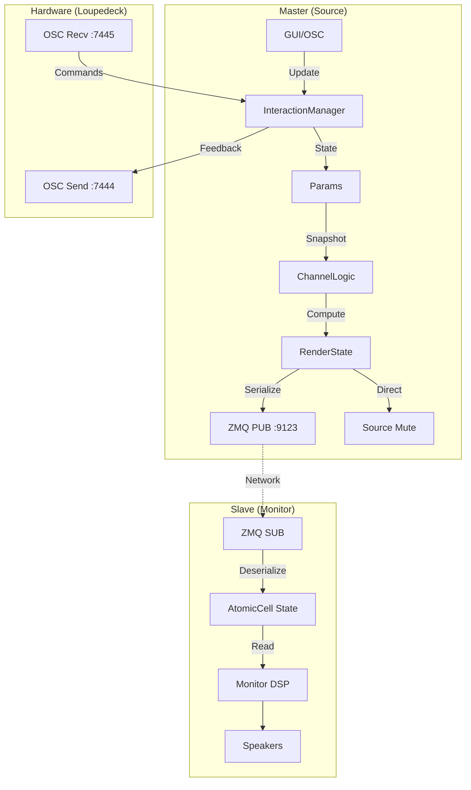

# 5. 功能模块设计 (更新于 2025.12.13)

本文档详细描述 Rust 版本的内部模块划分。

## 5.1 核心数据流 (v4.0 Revised)

核心思想是构建一个清晰的、单向的、跨网络的流式架构。



## 5.2 模块详解

### 5.2.1 `Params` (参数定义)
在 `Params.rs` 中定义的单一真理源。

**全局控制**:
- `master_gain`: 主音量 (0.0 ~ 1.0)
- `is_cut`: Cut 静音开关
- `is_dim`: Dim 衰减开关 (-20dB)

**通道参数** (32 通道):
- Main 通道: L, R, C, LFE, LSS, RSS, LRS, RRS, LTF, RTF, LTB, RTB
- SUB 通道: SUB_F, SUB_B, SUB_L, SUB_R

**运行时配置**:
- `role`: Master / Slave / Standalone
- `network_port`: ZMQ 端口 (默认 9123)

### 5.2.2 `ChannelLogic` (语义逻辑核心)
纯函数模块，位于 `channel_logic.rs`。

```rust
pub fn compute(params: &MonitorParams, interaction: &InteractionManager) -> RenderState
```

**输入**:
- `Params` 快照 (Cut/Dim/Volume)
- `InteractionManager` 状态 (Solo/Mute 集合)

**输出**: `RenderState` (音频处理直接使用)

```rust
pub struct RenderState {
    pub master_gain: f32,           // 主增益 (含 Dim 衰减)
    pub channel_gains: [f32; 32],   // 各通道增益
    pub channel_mute_mask: u32,     // 通道静音掩码
}
```

### 5.2.3 `NetworkManager` (网络层)
位于 `Network.rs`，负责 ZMQ 通信。

**Master 端**:
- `NetworkPublisher`: 绑定 `tcp://0.0.0.0:9123`
- 每帧广播 `NetworkRenderState`

**Slave 端**:
- `NetworkSubscriber`: 连接 `tcp://127.0.0.1:9123`
- 后台线程持续接收，原子更新缓存

**协议格式** (`Network_Protocol.rs`):
```rust
pub const PROTOCOL_VERSION: u8 = 2;

#[repr(C)]
pub struct NetworkInteractionState {
    // === 协议元数据 ===
    pub protocol_version: u8,      // 协议版本号 (必须=2)
    pub magic: u16,                // 魔数 0x4D43 ("MC")
    pub timestamp: u64,            // 毫秒时间戳

    // === 模式状态 ===
    pub primary: u8,
    pub compare: u8,

    // === 通道状态 ===
    pub solo_mask: u32,
    pub mute_mask: u32,
    pub user_mute_sub_mask: u8,

    // === 全局控制 ===
    pub master_gain: f32,
    pub dim: bool,
    pub cut: bool,

    // === v2 新增 ===
    pub layout: i32,
    pub sub_layout: i32,
    pub automation_mode: bool,
}
```

**心跳超时机制 (v2.5.0)**:
- 超时阈值: 2000ms
- Slave 检测到超时后自动触发 `request_network_restart()` 重连

### 5.2.4 `AudioProcessor`
位于 `Audio.rs`，执行实际的音频处理。

**Master**: 读取 `RenderState`，执行 Source Mute（用于校准）
**Slave**: 读取网络缓存，执行 Monitor Mute + Gain/Dim

**关键代码路径**:
```
RenderState → channel_gains/mute_mask → 逐采样应用增益
```

### 5.2.5 `Editor` (GUI)
基于 `egui` + `wgpu` 的界面，位于 `Editor.rs`。
- 可视化 `Params` 状态
- 处理用户交互（点击触发 `InteractionManager`）
- 显示 Solo/Mute 状态（颜色、闪烁）

---

## 5.3 交互状态管理 (`InteractionManager`) - v4.0 详细设计

位于 `Interaction.rs`，实现完整的 v4.0 交互规范。

### 5.3.1 核心状态模型

```rust
pub struct InteractionManager {
    // 主模式 (常亮)
    primary: RwLock<PrimaryMode>,      // None | Solo | Mute

    // 比较模式 (闪烁)
    compare: RwLock<CompareMode>,      // None | Solo | Mute

    // 通道集合
    solo_set: RwLock<ChannelSet>,      // Solo 上下文
    mute_set: RwLock<ChannelSet>,      // Mute 上下文

    // 记忆标记 (用于自动反转)
    solo_has_memory: RwLock<bool>,
    mute_has_memory: RwLock<bool>,

    // SUB 用户静音 (优先级最高)
    user_mute_sub: RwLock<HashSet<String>>,
}
```

### 5.3.2 模式切换逻辑

| 当前状态 | 点击 SOLO | 点击 MUTE |
|---------|-----------|-----------|
| Idle | → Solo Active | → Mute Active |
| Solo Active | → Idle (清空) | → Solo+Mute Compare |
| Mute Active | → Mute+Solo Compare | → Idle (清空) |
| Solo+Mute Compare | → Idle (点击常亮) / 退出Compare (点击闪烁) | 同左 |

### 5.3.3 自动反转逻辑

当从 Solo Active 进入 Mute Compare 时：
- 如果 `mute_has_memory = false`，则 `mute_set = copy(solo_set)`
- 语义：被 Solo 的通道 → 变成被 Mute 的通道

```rust
fn copy_set(&self, source: &ChannelSet) -> ChannelSet {
    // 只拷贝 Main 通道，SUB 不参与自动反转
    source.channels.iter()
        .filter(|name| !name.starts_with("SUB"))
        .cloned()
        .collect()
}
```

### 5.3.4 通道显示计算

```rust
pub fn get_channel_display(&self, ch_name: &str) -> ChannelDisplay {
    // 返回: has_sound (bool), marker (Solo/Mute/None), is_blinking (bool)
}
```

**Main 通道规则**:
- 使用当前激活的上下文（Compare 优先）
- Compare 模式下被选中的通道闪烁

**SUB 通道规则**:
- **永远使用 Primary 模式的集合**（不参与自动反转）
- User Mute 优先级最高
- 豁免权：如果只有 Main 有状态，SUB 自动获得声音

### 5.3.5 热重载支持 (v2.5.0 新增)

```rust
impl InteractionManager {
    /// 请求 OSC 热重载
    pub fn request_osc_restart(&self, config: AppConfig);

    /// 请求 Network 热重载
    pub fn request_network_restart(&self, config: AppConfig);

    /// 取出 OSC 重启请求 (process() 中调用)
    pub fn take_osc_restart_request(&self) -> Option<AppConfig>;

    /// 取出 Network 重启请求 (process() 中调用)
    pub fn take_network_restart_request(&self) -> Option<AppConfig>;

    /// 布局切换时清理状态
    pub fn clear_on_layout_change(&self);
}
```

### 5.3.6 渲染快照 (无锁读取)

```rust
pub struct RenderSnapshot {
    pub primary: u8,
    pub compare: u8,
    pub solo_mask: u32,
    pub mute_mask: u32,
    pub user_mute_sub_mask: u8,
}

// 音频线程无锁读取
let snapshot = interaction.get_render_snapshot();  // AtomicCell::load()
```

---

## 5.4 实例级日志系统 (v2.5.0 新增)

位于 `logger.rs`，提供每实例独立日志。

### 5.4.1 核心结构

```rust
pub struct InstanceLogger {
    instance_id: String,           // 唯一实例标识 (8位十六进制)
    file_path: Option<PathBuf>,    // 日志文件路径
    file_handle: Option<Mutex<BufWriter<File>>>,
    ui_buffer: Mutex<VecDeque<LogEntry>>,  // UI 显示缓冲 (最近50条)
}

pub struct LogEntry {
    pub timestamp: String,
    pub level: LogLevel,
    pub module: String,
    pub message: String,
}
```

### 5.4.2 关键 API

```rust
impl InstanceLogger {
    pub fn new() -> Self;

    /// 重要日志 - 同时写入文件和 UI 缓冲
    pub fn important(&self, module: &str, message: &str);

    /// 普通日志 - 仅写入文件
    pub fn info(&self, module: &str, message: &str);
    pub fn warn(&self, module: &str, message: &str);
    pub fn error(&self, module: &str, message: &str);

    /// 获取 UI 显示的最近日志
    pub fn get_recent_logs(&self) -> Vec<LogEntry>;
}
```

### 5.4.3 日志文件

- **默认路径**: `C:/Plugins/MCM_Logs/`
- **Fallback**: `%TEMP%/MonitorControllerMax_Logs/`
- **文件命名**: `MCM_{instance_id}_{timestamp}.log`

---

## 5.5 OSC 硬件集成

位于 `Osc.rs`，实现与 Loupedeck 的双向通信。

**端口配置 (v2.5.x)**:
- 发送端口: 7444 (插件 → 硬件)
- 接收端口: 7445 (硬件 → 插件)

### 5.5.1 OSC 地址映射

| 地址 | 方向 | 值 | 说明 |
|------|------|-----|------|
| `/Monitor/Mode/Solo` | 双向 | 0/1/2 | Solo 模式 (0=Off, 1=Toggle, 2=激活) |
| `/Monitor/Mode/Mute` | 双向 | 0/1/2 | Mute 模式 |
| `/Monitor/Channel/{name}` | 双向 | 0~12 | 通道控制 |
| `/Monitor/Cut` | 双向 | 0/1 | Cut 开关 |
| `/Monitor/Dim` | 双向 | 0/1 | Dim 开关 |
| `/Monitor/Volume` | 双向 | 0.0~1.0 | 主音量 |

### 5.5.2 通道值语义 (v4.0 扩展)

| 值 | 语义 | 说明 |
|-----|------|------|
| 0 | Off | 移除选中状态 |
| 1 | Mute | 在 Mute 上下文中选中 |
| 2 | Solo | 在 Solo 上下文中选中 |
| 10 | 有声音 | 语义层：在任何上下文中 "让这个通道有声音" |
| 11 | 没声音 (增量) | 仅移除，不退出空模式 |
| 12 | 没声音 (可退出) | 移除后如果集合为空，自动退出模式 |

### 5.5.3 闪烁同步

Compare 模式下，被选中的通道需要闪烁：
- Rust 端维护 `blink_counter`
- C# 端接收闪烁状态并更新 LED

---

## 5.5 Loupedeck C# 插件 (`MonitorOSCPlugin`)

位于 `c:\Code\LogiPluginSdkTools\MonitorOSCPlugin\`。

### 5.5.1 核心类

- `Group_Dial_Base.cs`: 通道旋钮基类
  - 右转 = 有声音 (value=10)
  - 左转 = 没声音 (value=11/12)
  - `_isModeActivator` 追踪是否由此旋钮激活模式

- `Master_Volume_Dial.cs`: 主音量旋钮
  - 旋转控制音量
  - 按下切换 Cut

- `OSCStateManager.cs`: 状态同步管理器
  - 维护所有 OSC 地址的当前值
  - 提供状态变化事件
